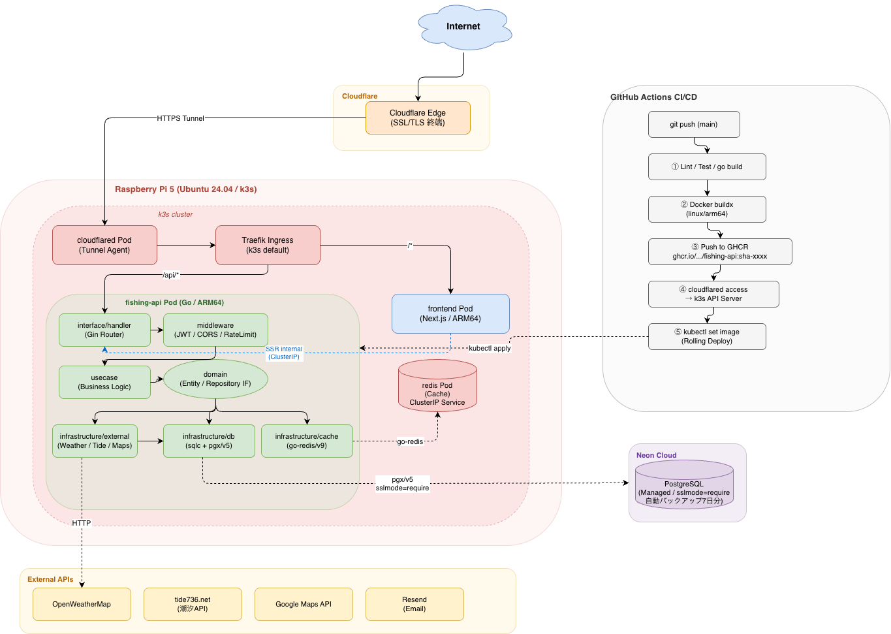

# Fishing-api

[FishingConditionsApp](https://github.com/kazumadev619-dev/FishingConditionsApp) のGoバックエンド。
釣り条件（天気・潮汐・スコア）を提供するREST API。

## 概要

| 項目 | 内容 |
|------|------|
| 言語 | Go 1.26 |
| フレームワーク | Gin v1.12 |
| DB | PostgreSQL 17（Neon マネージドクラウド） |
| キャッシュ | Redis 7（k3s Pod + ClusterIP Service） |
| デプロイ先 | Raspberry Pi 5 + k3s + Cloudflare Tunnel |
| ドメイン | `fishing.kazuma-lab.com` |

## API エンドポイント

| メソッド | パス | 説明 | 認証 |
|---------|------|------|------|
| GET | `/health` | ヘルスチェック | 不要 |
| POST | `/api/auth/register` | ユーザー登録 | 不要 |
| POST | `/api/auth/login` | ログイン | 不要 |
| POST | `/api/auth/refresh` | トークンリフレッシュ | 不要 |
| GET | `/api/auth/verify-email` | メール認証 | 不要 |
| GET | `/api/weather` | 天気情報取得 | 不要 |
| GET | `/api/tide` | 潮汐情報取得 | 不要 |
| GET | `/api/location/search` | 地点検索 | 不要 |
| GET | `/api/score` | 釣り条件スコア取得 | 不要 |
| GET | `/api/favorites` | お気に入り一覧 | JWT必要 |
| POST | `/api/favorites` | お気に入り追加 | JWT必要 |
| DELETE | `/api/favorites/:id` | お気に入り削除 | JWT必要 |

## アーキテクチャ



クリーンアーキテクチャ（依存は内側のみ）：

```
domain → usecase → infrastructure / interface
```

```
cmd/server/        エントリポイント
config/            環境変数設定
domain/            エンティティ・リポジトリIF
usecase/           ビジネスロジック
infrastructure/    DB・外部API実装
interface/         HTTPハンドラー・ミドルウェア
pkg/               JWT・バリデーター
db/                sqlc スキーマ・クエリ
k8s/               Kubernetes マニフェスト
```

## デプロイ構成

```
[GitHub push to main]
      ↓
[GitHub Actions] CI（test + lint）
      ↓
[Docker buildx] linux/arm64 イメージビルド
      ↓
[GHCR] ghcr.io/kazumadev619-dev/fishing-api:sha-xxxxx
      ↓
[Cloudflare Tunnel] k3s API アクセス
      ↓
[kubectl] Raspberry Pi k3s ローリングデプロイ
```

- **PostgreSQL**: Neon（マネージドクラウド）
- **Redis**: k3s Pod（ClusterIP Service）— キャッシュ用途のみなのでデータ消失時は再取得で対応
- **アプリ**: k3s Pod
- **ルーティング**: Traefik Ingress（`/api/*` → Go, `/*` → Next.js）
- **フロントエンド → バックエンド通信**: ブラウザからは Cloudflare 経由、Next.js SSR からは ClusterIP 直通（`fishing-api-service:8080`）

## ローカル開発

```bash
# 前提: Go 1.26+, Docker, sqlc, golangci-lint

# 環境変数設定
cp .env.example .env

# DB・Redis 起動
make docker-up

# sqlc コード生成
make sqlc-gen

# サーバー起動
make run

# 動作確認
curl http://localhost:8080/health
```

## コマンド一覧

```bash
make run         # 開発サーバー起動（:8080）
make test        # 全テスト実行
make lint        # Lint チェック
make sqlc-gen    # sqlc コード再生成
make docker-up   # DB・Redis 起動
make docker-down # DB・Redis 停止
make build       # バイナリビルド（./bin/server）
```

## ドキュメント

- [設計ドキュメント](docs/superpowers/specs/2026-04-07-go-backend-design.md)
- [開発コントリビューションガイド](CONTRIBUTING.md)
- [Phase 0: リポジトリ整備](docs/superpowers/plans/2026-04-07-go-backend-phase0-repo-setup.md)
- [Phase 1: 基盤構築](docs/superpowers/plans/2026-04-07-go-backend-phase1-foundation.md)
- [Phase 2: 認証](docs/superpowers/plans/2026-04-07-go-backend-phase2-auth.md)
- [Phase 3: コアAPI](docs/superpowers/plans/2026-04-07-go-backend-phase3-core-apis.md)
- [Phase 4: デプロイ](docs/superpowers/plans/2026-04-07-go-backend-phase4-deployment.md)
