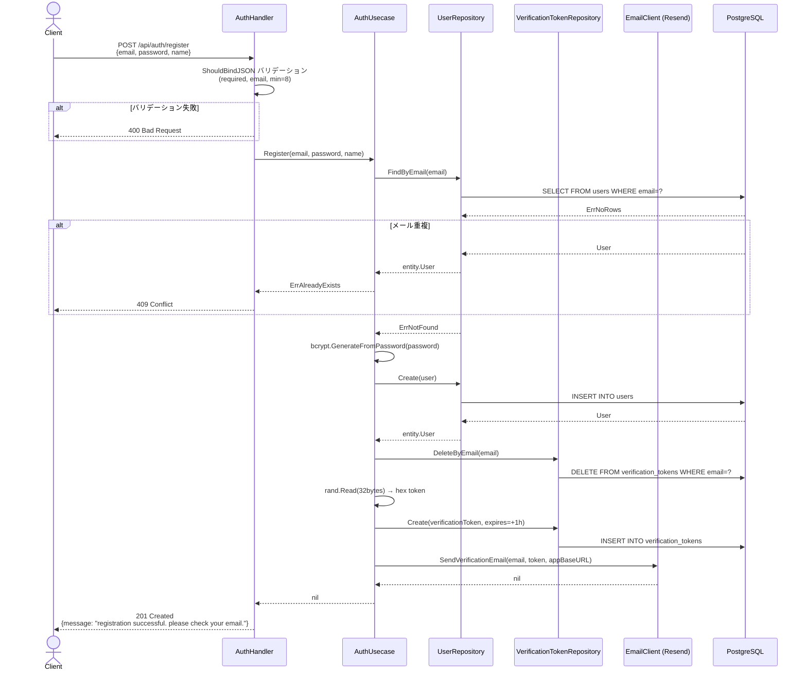
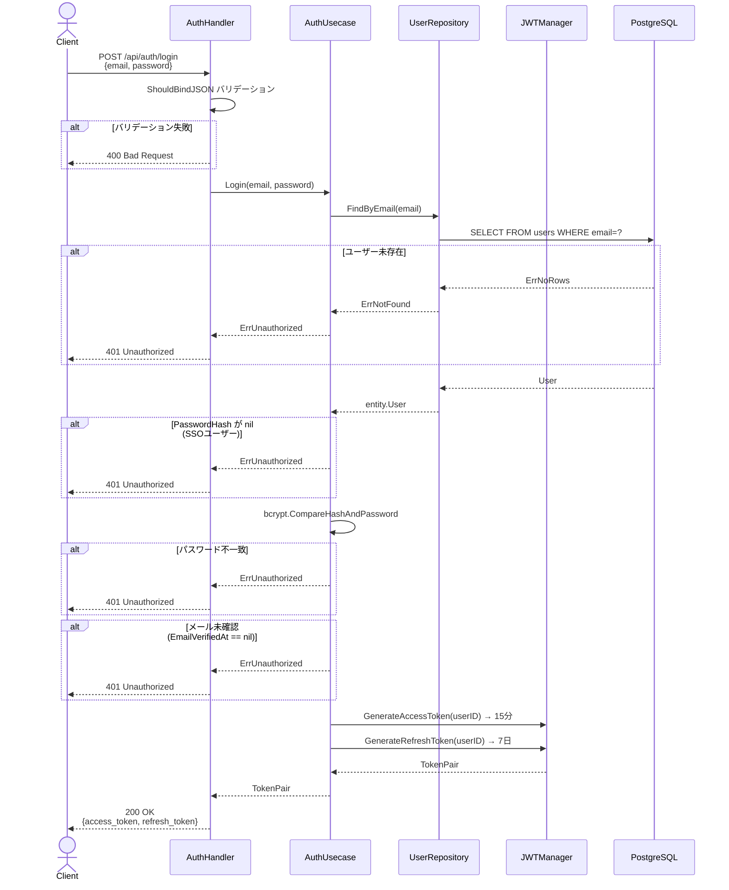
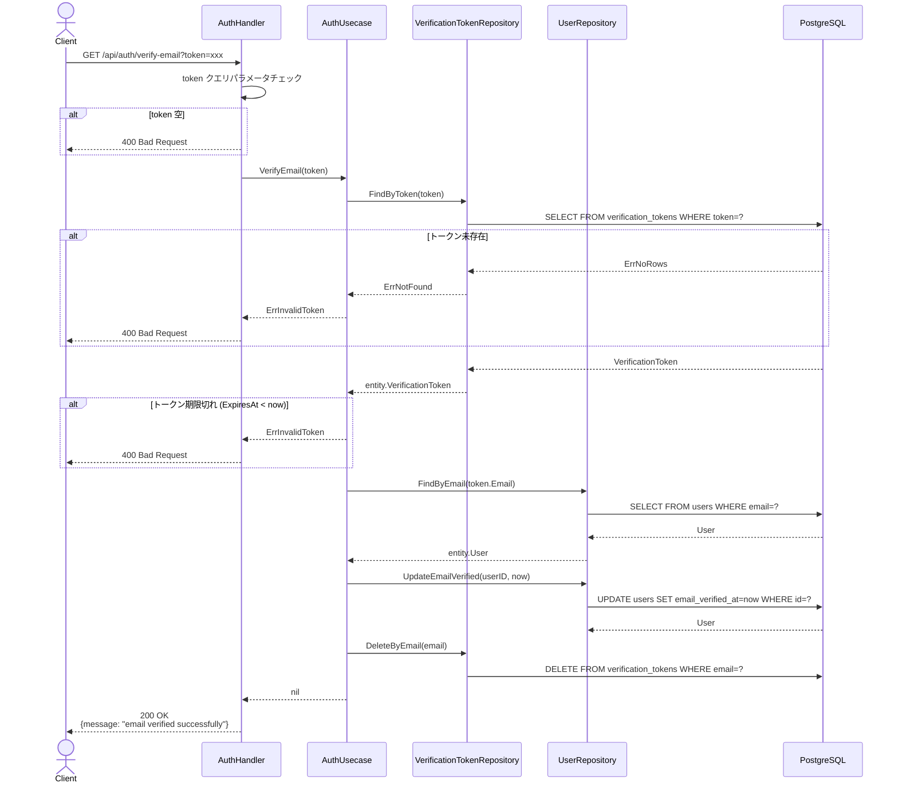
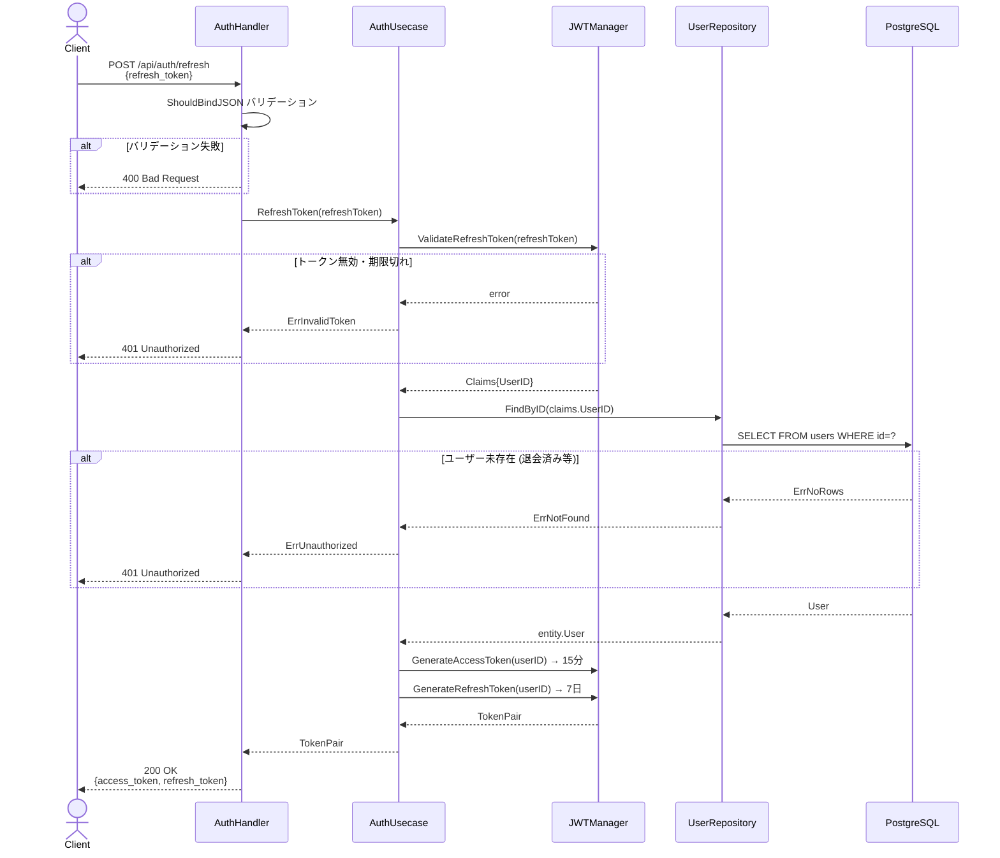
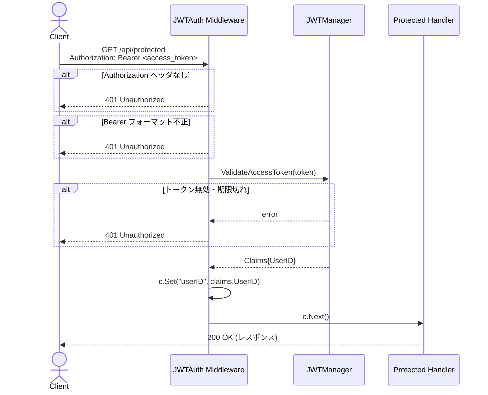

# 認証フロー シーケンス図

## 1. ユーザー登録 (POST /api/auth/register)

---

## 2. ログイン (POST /api/auth/login)

---

## 3. メール確認 (GET /api/auth/verify-email?token=xxx)

---

## 4. トークンリフレッシュ (POST /api/auth/refresh)

---

## 5. 認証済みAPIアクセス (JWTミドルウェア)

